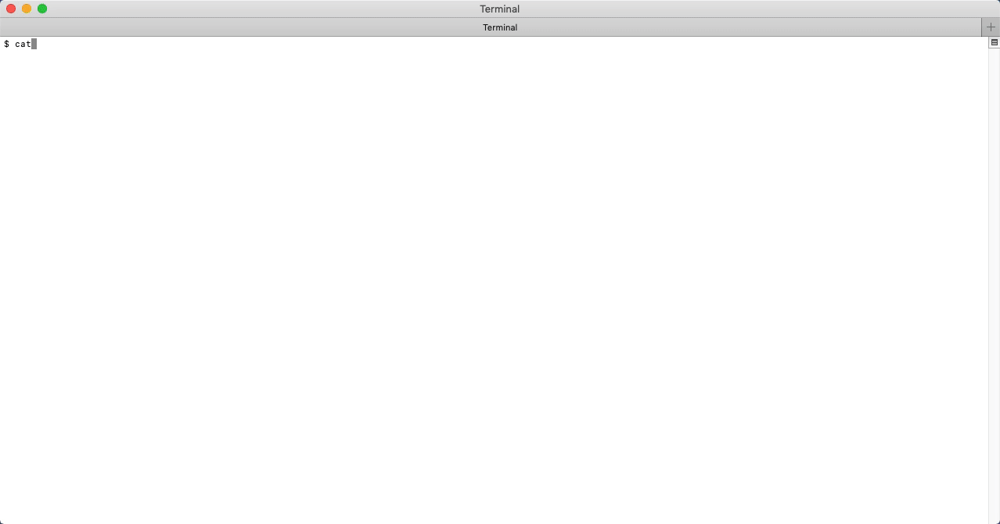
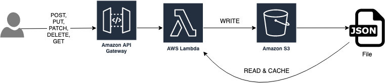
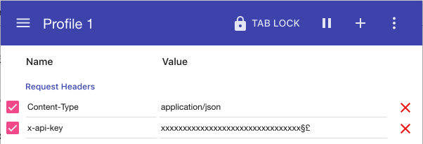

# JSON Serverless [](https://renovatebot.com/) [](https://travis-ci.org/pharindoko/json-serverless) [](https://opensource.org/licenses/MIT) [](https://deepscan.io/dashboard#view=project&tid=8861&pid=11081&bid=160781)<a href="https://codeclimate.com/github/pharindoko/json-serverless/maintainability"></a> 



## Features

- Create a REST API out of a [json-server](https://github.com/typicode/json-server) compatible JSON-File
- Swagger UI integrated (Swagger spec automatically generated)
- GrapqhiQL integrated (Graphql schema automatically generated)
- Additional JSON File validations at startup
- Readonly or Read/Write Mode (file stored in S3 Bucket)
- Deployment in AWS:
  - [Own CLI to test locally and immediately deploy it to the cloud](https://github.com/pharindoko/json-serverless/tree/master/packages/cli)
  - Deployed in AWS cloud within Minutes by a single command
  - Almost **zero costs** (First million requests for Lambda are free)
  - Less maintenance as the deployed solution runs **serverless**
- Security:
  - Secured with https by default.
  - Optional: Use a generated API Key
- Customization:
  - This solution written in **Typescript** can be easily extended for additional enhanced scenarios
    - adding user authentication ([Here`s an example](https://github.com/pharindoko/jsonsls-vue-cognito-demo))
    - own custom domain
    - additional routes etc.

## QuickStart 

### 1. Install Solution

```bash
npm i -g json-serverless
```

### 2. Run local

1. create a jsonserver-file sample e.g. db.json

   ```
   {
       "posts": [
         { "id": 1, "title": "json-server", "author": "typicode" },
         { "id": 2, "title": "test", "author": "yourAuthor" }
       ],
       "comments": [
         { "id": 1, "body": "some comment", "postId": 1 }
       ],
       "profile": { "name": "typicode" }
   }
   ```

2) execute command

   ```
   jsonsls run db.json
   ```

### 3. Deploy api to AWS

1. Verify that you have a AWS account and set appropriate credentials
2. execute command

   ```bash
   jsonsls create-stack db.json {optional: STAGE}
   ```

- a stack template folder will be created that contains the deployable serverless framework solution.
  <b>You can use the serverless cli in this stack template folder.</b>

* When the deployment was successful you can see following output

  <pre>
  <code>
  Service Information
  service: serverless-json-server
  stage: dev
  region: eu-central-1
  stack: serverless-json-server-dev
  api keys:
    serverless-json-server.dev: <b>{API-KEY}</b>
  endpoints:
    ANY - <b>https://xxxxxx.execute-api.eu-central-1.amazonaws.com/dev/ <== {ENDPOINTURL}</b>
    ANY - https://xxxxxxx.eu-central-1.amazonaws.com/dev/{proxy+}
  functions:
    app: serverless-json-server-dev-app
  layers:
    None
  Serverless: Removing old service artifacts from S3...
  </pre></code>

### 4. Test your Api

Open the {ENDPOINTURL}: https://xxxxxx.execute-api.eu-central-1.amazonaws.com/dev/ that you received as output

| Features              | Relative Path | Sample with Endpoint                                                |
| --------------------- | ------------- | ------------------------------------------------------------------- |
| Swagger UI            | /ui           | https://xxxxxx.execute-api.eu-central-1.amazonaws.com/dev/ui        |
| Swagger Specification | /api-spec     | https://xxxxxx.execute-api.eu-central-1.amazonaws.com/dev/api-spec  |
| GraphiQL              | /graphql      | https://xxxxxx.execute-api.eu-central-1.amazonaws.com/dev/graphql   |
| API Routes            | /api/{routes} | https://xxxxxx.execute-api.eu-central-1.amazonaws.com/dev/api/posts |

**MIND**: If you have set enableApiKeyAuth to true => [SwaggerUI](#Cannot-use-Swagger-UI-when-enableApiKeyAuth-is-true)
)

#### With Curl

1. replace the url with the url provided by serverless (see above)
2. replace the {API-KEY} with the key you get from serverless (see above)
3. replace {route} at the end of the url e.g. with posts (default value)

Default Schema:

```bash
Default route is posts: (see db.json)
curl -H "Content-Type: application/json" https://xxxxxx.execute-api.eu-central-1.amazonaws.com/dev/api/posts

# or another route given in db.json file
curl -H "Content-Type: application/json" https://xxxxxx.execute-api.eu-central-1.amazonaws.com/dev/api/{route}

# with enableApiKeyAuth=true
curl -H "x-api-key: {API-KEY}" -H "Content-Type: application/json" https://xxxxxx.execute-api.eu-central-1.amazonaws.com/dev/api/{route}

```

What`s my {route} ? -> see [json-server documentation](https://github.com/typicode/json-server)

## Architecture in AWS



## Customization

### Examples

Please have a look at this example to see how you can add own middleware and authentication.  
https://github.com/pharindoko/jsonsls-vue-cognito-demo

### Update content of db.json

1. update local db.json file in root directory with new values
2. re-deploy the stack via serverless framework

   ```bash
    jsonsls update-stack
   ```

3. delete db.json file in S3 Bucket
4. Make a GET request against the root url https://xxxxxx.execute-api.eu-central-1.amazonaws.com/dev/api

```bash
curl -H "Content-Type: application/json" https://xxxxxx.execute-api.eu-central-1.amazonaws.com/dev/api

# with enableApiKeyAuth=true
curl -H "x-api-key: {API-KEY}" -H "Content-Type: application/json" https://xxxxxx.execute-api.eu-central-1.amazonaws.com/dev/api/{route}


```

=> With the next request a new db.json file will be created in the S3 Bucket

### Adapt settings (in the stackfolder you can find this config under ./config/appconfig.json)

| Attribute            | Description                                                              | Type    | Default |
| -------------------- | ------------------------------------------------------------------------ | ------- | ------- |
| readOnly             | Make API readonly - all API - write operations are forbidden (http 403)) | string  | false   |
| enableApiKeyAuth     | Make your routes private by using an additional ApiKey                   | boolean | false   |
| enableJSONValidation | validate JSON file at start                                              | boolean | true    |
| enableSwagger        | enable or disable Swagger (and related Graphql) features                 | boolean | true    |

## Used Packages

- [json-server](https://github.com/typicode/json-server)
- [serverless framework](https://serverless.com/)
- [serverless http](https://github.com/dougmoscrop/serverless-http)
- [lowdb-adapter-aws-s3](https://github.com/nicekiwi/lowdb-adapter-aws-s3)

## Components

- [NodeJS 10](https://nodejs.org/en/about/)
- [AWS API Gateway](https://aws.amazon.com/api-gateway/)
- [AWS Lambda](https://aws.amazon.com/lambda/features/)
- [AWS S3](https://aws.amazon.com/s3/)

## Develop & Contribute

PRs are welcome!

### Overview

Please have a look into the makefile to get the understanding how this construct is built.
There are components managed: (under /packages)

- cli
  - built with oclif
  - main purpose is to enease the usage of the tool
  - creates a stack folder out of the template package
- server
  - the core component of the solution
  - has json server implemented under the hood
  - components will be injected from outside into the library (storageadapter, swagger)
  - can be customized and used without the other parts (could be deployed with docker)
  - library can be used standalone as well ([see example](https://github.com/pharindoko/json-serverless/tree/master/examples/simple-server))
- template

  - a serverless framework template
  - can be used standalone without the cli

    ```bash
      serverless create --template-url https://github.com/pharindoko/json-serverless/tree/master/packages/template

      npm i
      npm run build
      sls deploy
      sls offline
    ```

### Installation

```
make install
```

Lerna will be used to manage the monorepo`s dependencies.

```
lerna bootstrap
```

### Start the server component

```bash
make start-server
```

the json file will be loaded directly from your local filesystem. No AWS access is needed.

### Start the template component

This part is using the serverless offline and is close to how the solution behaves in the cloud.

```bash
make start-template
```

the json file will be loaded directly from your local filesystem. No AWS access is needed.

### Start the cli component

you should see a direct output of all local endpoints.

```bash
make start-cli
```

the json file will be loaded directly from your local filesystem. No AWS access is needed.

## FAQ

### Cannot use Swagger UI when enableApiKeyAuth is true

The apiKey is set in AWS API Gateway. This means all requests (even the standard route) need to use the API-KEY.

If you want to see the Swagger UI you need to add a plugin e.g. ModHeader to Chrome and add the needed headers:

- Content-Type: application/json
- x-api-key: {provided by sls info in the output after deployment}



### I forgot the API-KEY I have set

Ensure you have credentials for AWS set.

```bash
sls info
```

### Destroy the stack in the cloud

```bash
sls remove
```

### I deployed the solution but I get back a http 500 error

Check Cloudwatch Logs in AWS - the issue should be describe there. Log has the same name as the stack that has been created.
